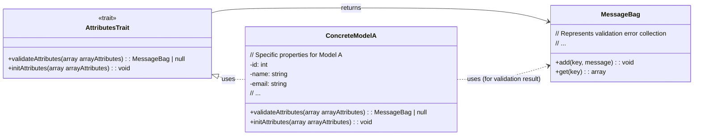

# APi Rest Template

Una plantilla de proyecto Laravel que sirve como base robusta para el desarrollo de APIs RESTful. Viene pre-configurada con las herramientas y patrones esenciales para una autenticación segura, documentación clara y versionado de API, acelerando el inicio de tus proyectos.

## 🌟 Características Destacadas
Autenticación API RESTful con Laravel Sanctum:

Configuración completa para el manejo de autenticación basada en tokens (Bearer Tokens).

Rutas de registro (/api/v2/auth/register), login (/api/v2/auth/login), obtención de datos del usuario autenticado (/api/v2/auth/me) y logout (/api/v2/auth/logout) ya definidas y listas para usar.

Manejo de tokens API ligero y seguro, ideal para SPAs, aplicaciones móviles y clientes de terceros.

Documentación de API con OpenAPI (Swagger/L5-Swagger):

Integración y configuración inicial de OpenAPI para generar documentación interactiva de tu API.

Anotaciones y estructura base ya establecidas para que puedas documentar tus endpoints de manera eficiente.

Facilita la colaboración y el consumo de tu API por parte de otros desarrolladores.

Versionado de API (/api/v2):

Estructura de rutas ya establecida con versionado explícito (/api/v2), permitiendo una evolución ordenada de tu API sin afectar versiones anteriores.

Listo para expandir a versiones futuras (v3, v4, etc.) de forma controlada.

Plantilla de Configuración Básica:

Un punto de partida limpio y optimizado, incluyendo las configuraciones esenciales de Laravel para un entorno de API.

Incluye los archivos .http (para la extensión REST Client de VS Code) pre-configurados para probar los endpoints de autenticación de forma inmediata.

## Licencia

Este código tiene licencia bajo la licencia pública general de GNU versión 3.0 o posterior (LGPLV3+). Puedes encontrar una copia completa de la licencia en https://www.gnu.org/licenses/lgpl-3.0-standalone.html

## Características ¿Qué te ofrece api-productos?


## Características a implementar


## Uso

### Requisitos 

Tener instalado 
- php
- composer
- Docker

### Instalacion 

Ejecuta el comando para instalar laravel sail, sactum y las demas depencias

composer install  

#### Docker
El proceso de instalacion esta gestionado por laravel sail mas concretamente por medio de docker-compose.yml

Eres libre de modificar dicho archivo a tu gusto

### Configuracinon y activacion del servidor

#### Archivo .env 

Establece una configuracion en el archivo .env. como la siguiente

```
DB_CONNECTION=<DBConnection>
DB_HOST=<Host>
DB_PORT=<Port>
DB_DATABASE=<DatabaseName>
DB_USERNAME=<UserName>
DB_PASSWORD=<Password>

En caso de querer usar postgresql

DB_CONNECTION=pgsql
DB_HOST=pgsql
DB_PORT=5432
DB_DATABASE=<DatabaseName>
DB_USERNAME=<UserName>
DB_PASSWORD=<password>

```

#### Activar servidor
Ejecuta el comando

sail up

#### Ejecuta migraciones
sail artisan migrate:refresh --seed


### Accede a la documentacion de la api

Utilizando la url generada por la configuracion de docker

en este caso http://127.0.0.1:80 

accede a la documentacion de la api

por medio de la url

http://127.0.0.1:80/api/documentation


#### Acceso a la api 

Para tener acceso a la api debes de logearte con un usuario. 
Para pruebas con la api se creo un usuario con las siguientes credenciales
un email "israeldavidvm@gmail.com" y password de "Password1234."


#### Consume la api

Puedes acceder a la api por medio de tu cliente http/https favorito postman, curl etc 

#### consumo de la api mediante rest client

El proyecto tiene un archivo de nombre request.http que puede ser usado para probar la api usando la extension de rest client

#### consumo de la api mediante swagger


#### consumo de la api mediante postman


## Planificación, Ingeniería de Requerimientos y Gestión de Riesgos

Estas secciones del proyecto se llevarán a cabo mediante un sitio en Notion, de forma que puedan ser fácilmente accesibles por el personal no técnico.

Solicita el link de acceso al personal autorizado.

## Diseño de Software

### Perspectiva Estructural

#### Vista Lógica de la Arquitectura del Software



### Perspectiva de comportamiento

### Diseño de Base de Datos

## Desiciones tecnicas

Con el objetivo de estandarizar el comportamiento de varios de los modelos se definio el trait israeldavidvm/eloquent-traits/src/AttributesTrait.php

El cual trae 2 metodos consigo el

abstract public static function validateAttributes(array $arrayAttributes): ?MessageBag;

Que permite validar los attributos que se van a asignar a un modelo, no repetir la logica y no depender de una Form Request Validation, cosa ventajosa en caso de querer crear una vista utilizando tecnologias como livewire o fillament

abstract public function initAttributes(array $arrayAttributes);

Que permite encapsular la logica de inicializacion de attributos para un modelo


## Verification and Validation / Validacion y Verificacion

# Ejecucion de test
```
sail test
```
