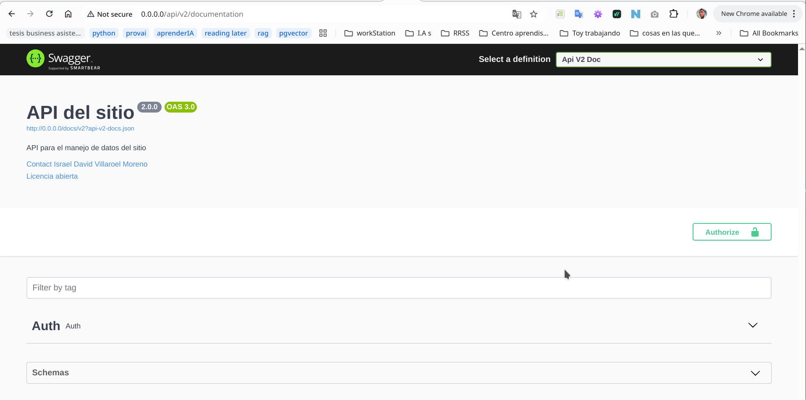
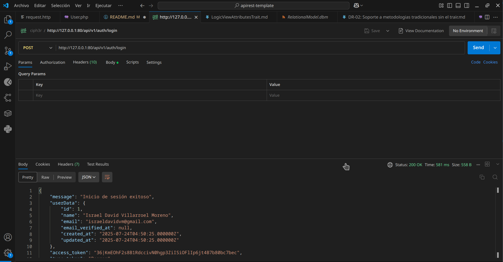

# APi Rest Template

Una plantilla de proyecto Laravel que sirve como base robusta para el desarrollo de APIs RESTful. Viene pre-configurada con las herramientas y patrones esenciales para una autenticación segura, documentación clara y versionado de API, acelerando el inicio de tus proyectos.

## 🌟 Características Destacadas
Autenticación API RESTful con Laravel Sanctum:

Configuración completa para el manejo de autenticación basada en tokens (Bearer Tokens).

Rutas de registro (/api/v2/auth/register), login (/api/v2/auth/login), obtención de datos del usuario autenticado (/api/v2/auth/me) y logout (/api/v2/auth/logout) ya definidas y listas para usar.

Manejo de tokens API ligero y seguro, ideal para SPAs, aplicaciones móviles y clientes de terceros.

Documentación de API con OpenAPI (Swagger/L5-Swagger):

Integración y configuración inicial de OpenAPI para generar documentación interactiva de tu API.

Anotaciones y estructura base ya establecidas para que puedas documentar tus endpoints de manera eficiente.

Facilita la colaboración y el consumo de tu API por parte de otros desarrolladores.

Versionado de API (/api/v2):

Estructura de rutas ya establecida con versionado explícito (/api/v2), permitiendo una evolución ordenada de tu API sin afectar versiones anteriores.

Listo para expandir a versiones futuras (v3, v4, etc.) de forma controlada.

Plantilla de Configuración Básica:

Un punto de partida limpio y optimizado, incluyendo las configuraciones esenciales de Laravel para un entorno de API.

Incluye los archivos .http (para la extensión REST Client de VS Code) pre-configurados para probar los endpoints de autenticación de forma inmediata.

## Características a implementar


## Licencia

Este código tiene licencia bajo la licencia pública general de GNU versión 3.0 o posterior (LGPLV3+). Puedes encontrar una copia completa de la licencia en https://www.gnu.org/licenses/lgpl-3.0-standalone.html

## Uso

Esta plantilla tiene 2 enfoques para manejar las validaciones he inicializacion de attributos. Dichos enfoques deben de ser selecionados dependiendo de los estandares del proyecto en el que se trabaje

1. Uso de Metodos con interfaces estandarizadaspor medio de Traits
Dicho enfoque sera el usado en la version 1 de la api y por consiguiente los controladores, test y demas elementos asociados 

2. Uso de Form Request
Dicho enfoque sera el usado en la version 2 de la api y por consiguiente los controladores, test y demas elementos asociados 

Para no ensuciar el model User se crearon 2 modelos

UserWithTrait que sera el destinado a ser usado por el enfoque #1 y el User que sera destinado a ser usado por el enfoque #2

### ADVAERTENCIA
A pesar de que el proyecto incluya los 2 enfoques para facilitar la eleccion dependiendo del caso en un proyecto se recomienda utilizar 1 solo de los enfoques para evitar confusiones

## Getting Started

### Requisitos 

Tener instalado 
- php
- composer
- Docker

### Clonar el Repositorio

git clone https://github.com/israeldavidvm/apirest-template.git

### Instalacion 

Ejecuta el comando para instalar laravel sail, sactum y las demas depencias
composer install

sail artisan key:generate

#### Docker
El proceso de instalacion esta gestionado por laravel sail mas concretamente por medio de docker-compose.yml

Eres libre de modificar dicho archivo a tu gusto

### Configuracinon y activacion del servidor

#### Archivo .env 

Establece una configuracion en el archivo .env. como la siguiente

```
DB_CONNECTION=<DBConnection>
DB_HOST=<Host>
DB_PORT=<Port>
DB_DATABASE=<DatabaseName>
DB_USERNAME=<UserName>
DB_PASSWORD=<Password>

En caso de querer usar postgresql

DB_CONNECTION=pgsql
DB_HOST=pgsql
DB_PORT=5432
DB_DATABASE=<DatabaseName>
DB_USERNAME=<UserName>
DB_PASSWORD=<password>

```

#### Activar servidor
Ejecuta el comando

sail up

#### Ejecuta migraciones
sail artisan migrate:refresh --seed


### Accede a la documentacion de la api

Utilizando la url generada por la configuracion de docker

en este caso http://127.0.0.1:80 

accede a la documentacion de la api

por medio de la url

http://127.0.0.1:80/api/v1/documentation

por medio de la url

http://127.0.0.1:80/api/v2/documentation


### Acceso a la api 

Para tener acceso a la api debes de logearte con un usuario. 
Para pruebas con la api se creo un usuario con las siguientes credenciales
un email "israeldavidvm@gmail.com" y password de "Password1234."

#### Consume la api

Puedes acceder a la api por medio de tu cliente http/https favorito postman, curl etc 

#### consumo de la api mediante rest client

El proyecto tiene un archivo de nombre request.http que puede ser usado para probar la api usando la extension de rest client

#### consumo de la api mediante swagger


#### consumo de la api mediante postman



## Engineering decisions

### Planificación, Ingeniería de Requerimientos y Gestión de Riesgos

Estas secciones del proyecto se llevarán a cabo mediante un sitio en Notion, de forma que puedan ser fácilmente accesibles por el personal no técnico.

Solicita el link de acceso al personal autorizado.

### Folder Structured

La estructura del proyecto va a seguir las convenciones de laravel 11 he incoporara los siguientes directorios y archivos

#### /israeldavidvm 

Para la incoporacion de codigo que se planea convertir a librerias o paquetes

#### /documentation

Directorio que almacena toda la documentacion del proyecto que no se incluyo en el readme para no ser tan extensiva su extension

#### /documentation/diagrams

Directorio que almacena los diagramas que serta usados durante el proyecto como MER, Modelo relacional, diagramas de aquitectura etc

#### /documentation/DR

Directorio donde seran almacenados los Registros de desicion (Decission Records) utilizados para registrar las decisiones tecnicas

#### /request.http

Contiene un archivo que puede usarse para probar las api por medio de rest client

#### app/Swagger

Se utiliza para almacenar elementos utilizados par ala generacion de documentacion por medio de open api (anteriormente conocida como swagger)

##### app/Swagger/ShareBase.php

Contiene elementos que se compartiran entre distintas versiones de las apis

##### app/Swagger/V1, app/Swagger/V2, ...

Contieme elementos especificos para cada version de la api que no seran incorporados directamente en las ubicaciones usuales como controladores

### Desiciones tecnicas

Las decisiones tecnicas se van a registrar por medio del Registros de desicion (Decission Records), y estaran almacenados en el directorio

```documentation/DR```

[Estandarización de la Validación e Inicialización de Atributos de Modelos con un Trait](<documentation/DR/DR-01: Estandarización de la Validación e Inicialización de Atributos de Modelos con un Trait.md>)

[Soporte a metodologias tradicionales sin el trair](<documentation/DR/DR-02: Soporte a metodologias tradicionales sin el trair.md>)


### Diseño de Software

#### Diseño de Base de Datos

Diagrama para pgmodeler
[Diagrama para pgmodeler](documentation/diagrams/database/RelationalModel.dbm)

#### Diseño AttributesTrait

##### Diagrama vista Lógica para el Attributes Trait

[Diagrama vista Lógica de la Arquitectura del Software para el Attributes Trait](documentation/diagrams/StructuralPerspective/LogicViewAttributesTrait.md)

##### Perspectiva de interacion

Si se desea modificar los attributos de un modelo se debe de usar el initAttributes()

Si se desea validar que un conjunto de attributos(representado array asociativo) es valido para realizar una operacion(crear, actualizar, eliminar) sobre una intancia de determinado modelo se debe generar un validador con generateValidator, el cual retornara una instancia de Illuminate\Validation\Validator, de manera que podremos aprovechar todos los metodos del mismo como validate(), ...


### Verification and Validation / Validacion y Verificacion

#### Test

Los test seran realizados por medio de PHP Unit

##### Ejecucion de test
```
sail test
```
